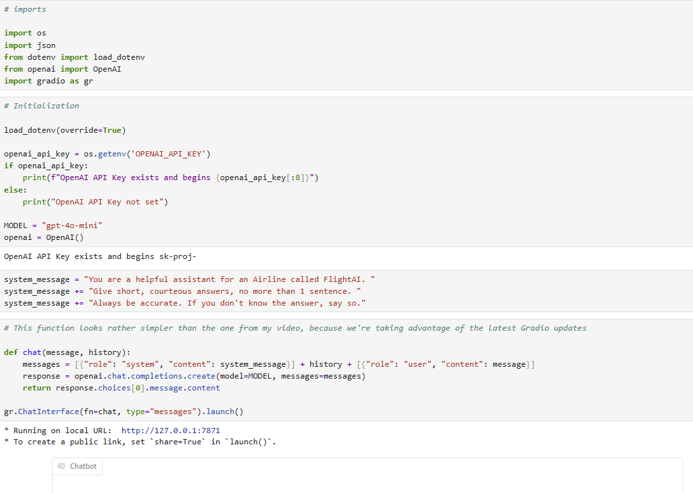

# 📘 Course Title: _LLM Engineering: Master AI, Large Language Models & Agents_

## 🗓️ Lecture Title: _Lecture Topic or Date_

## 🧠 Learning Objectives

• **Build advanced Generative AI products** using cutting-edge models and frameworks.

• **Experiment with over 20 groundbreaking AI models**, including Frontier and Open-Source models.

• **Develop proficiency with platforms** like HuggingFace, LangChain, and Gradio.

• **Implement state-of-the-art techniques** such as RAG (Retrieval-Augmented Generation), QLoRA fine-tuning, and Agents.

• **Create real-world AI applications**, including:

• A multi-modal customer support assistant that interacts with text, sound, and images.

• An AI knowledge worker that can answer any question about a company based on its shared drive.

• An AI programmer that optimizes software, achieving performance improvements of over 60,000 times.

• An ecommerce application that accurately predicts prices of unseen products.

• **Transition from inference to training**, fine-tuning both Frontier and Open-Source models.

• **Deploy AI products to production** with polished user interfaces and advanced capabilities.

• **Level up your AI and LLM engineering skills** to be at the forefront of the industry.

## 📝 Key Concepts

### 1. Frontier LLM

- Definition: The term "frontier LLM" refers to large language models that are at the cutting edge of AI research and development.
  These models typically represent the most advanced, capable, and powerful systems available at a given time. Here's a breakdown of what characterizes a frontier LLM:

      Key Characteristics of Frontier LLMs:
      Scale: They are trained on massive datasets using billions or even trillions of parameters.
      Performance: They achieve state-of-the-art results on a wide range of benchmarks, including reasoning, coding, translation, and more.
      Capabilities: They often exhibit emergent behaviors—skills or abilities that were not explicitly programmed or expected.
      Safety and Alignment Focus: Due to their power, frontier LLMs are often the focus of intensive safety, alignment, and governance efforts.
      Innovation: They incorporate the latest architectural, training, and optimization techniques.

- Examples:

  - GPT-4 and successors by OpenAI
  - Gemini by Google DeepMind
  - Claude by Anthropic
  - Command R+ by Cohere
  - LLaMA 3 by Meta

  (detailed examples in the annex)

### 2. Open-source LLM

- Definition: A type of artificial intelligence language model whose architecture, model weights, training data (or sufficient description of it), and/or training code are publicly available under a license that permits use, modification, and distribution by anyone. Is less performant than a Frontier model.
- Example: Ollama by Magistral AI
- Notes:

  In this course, we will run Ollama model locally on our machine by running OllamaSetup exe,
download from official site: https://ollama.com/.
  
  Ollama has been trained with way less parameters than frontier models.
  In the range of 100 000 vs
  trillion parameters for a frontier model.
  
  **Try it**: ollama run llama3.2 or llama3.2:1b, as a faster alternative.

### 3. Skills and tools for AI development

Models:

- open-source (public)
- closed-source (proprietary technology)
- multi-modal
- architecture
- selecting

Tools:

- HuggingFace
- LangChain
- Gradio
- Weights & Biases
- Modal

Techniques:

- APIs
- Multi-shot prompting
- RAG
- Fine-tuning
- Agentization

### 4. Understanding Frontier models: GPT, Claude & Open-Source LLMs

- Closed-Source Frontier:

  - GPT from OpenAI
  - Claude from Anthropic
  - Gemini from Google
  - Command R from Cohere
  - Perplexity

- Open-Source Frontier:
  - Llama from Meta (Ollama named after)
  - Mixtral from Mistral
  - Qwen from Alibaba Cloud
  - Gemma from Google - smaller
  - Phi from Microsoft - smaller

**Three ways to use models**:

1. Chat interfaces (like ChatGPT which currently uses GPT-3.5 Turbo)
2. Cloud APIs (LLM API)
   Frameworks like LangChain

   Managed AI cloud services:

   - Amazon Bedrock
   - Google Vertex
   - Azure ML

Here you are connecting with a provider like Amazon, Google Azure and they are running the model on their cloud.
Offering you to choose between closed-source or open-source models.

3. Direct inference
   With the HuggingFace
   Transformers library
   With Ollama to run locally

- Using google collab -> running in the cloud for power
- Using Ollama to run locally (optimized using C++ - CPP)

### 5. Key knowledge

- RAG - knowledge store to apply to LLMs
- Fine tuning Frontier model
- Fine tuning an open-source model
- Gradio: build a nice sharp user interface very quickly
- Agents to solve a real world case scenario

## Installation

- Install Python version 3.11.9 (not latest), because this version supports better data science dependencies (as discussed in course)

Complete installation setup for PC:
https://github.com/ed-donner/llm_engineering/blob/main/README.md

Chose not to install Anaconda (heavy data science env.) and instead intstall a lightweight virtual environment using python.
I followed Part 2B - Alternative to Part 2.

**Recurring commands**

From within the llm_engineering folder in a Windows Terminal, run:

- Activate the environment:

  - venv\Scripts\activate

- Start jupyter lab:
  - jupyter lab

Setting up OpenAI API for LLM

- Setting up API keys with OpenAI
- Adding to the project folder an .env file with a OpenAI API generated key
- Load the configuration into the Python script using a package like python-dotenv

## Implementing text summarization using OpenAI's GPT-4 and BeautifulSoup

Goal: calling the cloud API of a Frontier model (a leading model at the frontier of AI)

1. Using OpenAI completion API with GPT-4o-mini
2. Using summarization - a classic Gen AI use case to make a summary (web scraping)

**Types of prompts**

Models like GPT4o have been trained to receive instructions in a particular way.
They expect to receive:

- A system prompt that tells them what task they are performing and what tone they should use

- A user prompt -- the conversation starter that they should reply to

Frontier models trained in two different ways, so they are:

- system prompt

  - provides context, tone

- user prompt
  - conversation itself

## Limitations of frontier models
- Specialized domains (most are not Phd level, but closing in). For example, Claude 3.5 Sonnet
has surpassed Phd level in math, chemistry, physics.
- Recent events (limited knowledge beyond training cut-off date)
- Can confidently make mistakes (curious blindspots)

## Comparing leading LLMs: strengths & business applications

OpenAI's o1 preview + Perplexity got this right. Many models are getting it wrong!
Input is tokenized so the LLM cannot understand the meaning of letters inside the token.

- GPT-4o: fast, intelligent, flexible
- Claude 3.5 Sonnet: code, scientific LLM, broader socio-economic knowledge.
- Claude 3 Opus
- Gemini Pro 1.5
- CommandR+
- Meta AI (FE version of LLama): good with generation
- Perplexity (search engine not LLM): test with current events with specific/detailed answer.

- All 6 forntier LLMs are shockingly good!
- Claude tends to be favored by practioners: more humorous, more attention to safety, more concise

Differenciator: cost (as they converge in capability)

## The Journey

- GPT store: experiment with tuning GPT LLMs
- Agents: orchestrate LLMs

## LLM Parameters (weights)

## LLM Tokens

## LLM Context Window

- Whole conversation so far (Input/Output tokens)

Question:
Est-ce que le cached input fait parti du compte du context window?

Non, le « cached input » (ou les entrées mises en cache) **ne font pas directement partie du décompte de la context window** d’un modèle LLM comme ceux d’OpenAI.

## Chatbots

## Assistant

Tools
Tools are an incredibly powerful feature provided by the frontier LLMs.

With tools, you can write a function, and have the LLM call that function as part of its response.

 :
User > assistant > user > tools (we call our tool function) > assistant

Workflow:
### Typical Workflow
1. **User**: “What’s the weather in Paris?”
2. **Assistant**: (Detects the need for weather info, sends a function call instruction for getWeather("Paris"))
3. **Developer/Backend**: Executes the weather API call, sends result back to Assistant.
4. **Assistant**: Formats a natural answer: “It’s 23°C and sunny in Paris today.”

(AI chat assistant is not able to access live data or external APIs directly)

or
- (i.e., “If the payment fails, ask for a different card”).

**In summary:**
The Assistant acts as the brains and conductor.
You (the developer/backend) handle the hands and feet, carrying out the external “actions.”
This keeps your systems secure while leveraging the Assistant’s reasoning skills to create powerful, conversational interfaces.

## One shot prompting/multi shot prompting

### Key Differences
- **One-shot:** Model gets **one** example before the task.
- **Multi-shot:** Model sees **several** examples before the task.

Both are part of _few-shot learning_ techniques used to guide LLM outputs.

## Agents

## Assistant
**Definition:**
An **assistant** in the context of AI or software is a system primarily designed for natural language interaction and task management. It specializes in handling conversations, guiding users through processes, suggesting actions, and can coordinate the use of various tools based on user requests.
**Key Features:**
- **Conversational:** Communicates with users using natural language.
- **Tool-orchestration:** Can request or suggest actions, such as calling functions or accessing information sources—action execution is often handled by another component.
- **Process Management:** Coordinates multi-step tasks or workflows based on user input.
- **Memory:** Can reference previous conversation history to provide continuity.

## Agent
**Definition:**
An **agent** is a software entity capable of autonomous action in a given environment to achieve specific goals. Agents can reason, plan, make decisions, and directly interact with other systems or environments to accomplish their objectives, often operating with minimal human oversight.
**Key Features:**
- **Autonomous:** Makes and executes decisions independently.
- **Goal-oriented:** Acts to accomplish specified objectives, often optimizing for certain outcomes.
- **Environment Interaction:** Senses and acts upon its environment or systems, sometimes in real time.
- **Adaptivity:** May learn from new data or experiences to improve effectiveness.

## Key Differences

|  | Assistant | Agent |
| --- | --- | --- |
| **Primary Role** | Conversational coordination | Autonomous action |
| **Action** | Requests or suggests actions | Directly executes actions |
| **Supervision** | Often needs another component to act | Can operate independently |
| **Task Scope** | Guides tasks through dialogue | Seeks to fulfill goals on its own |
| **Examples** | Chatbots, virtual assistants | Automated trading bots, smart home controllers |
**In summary:**
- An **assistant** focuses on understanding user intent and managing tasks through dialogue, often relying on other systems to actually perform actions.
- An **agent** is built for autonomy, making decisions and acting in pursuit of goals, sometimes with limited or no direct human involvement.

## Hugging Face

Explanation of the concepts:

## 1. **Hub**
**What is it?**
The **Hugging Face Hub** is an online platform and repository where users can share, discover, and download pre-trained models, datasets, and other machine learning resources.
**Key points:**
- Hosts thousands of public models and datasets.
- Supports versioning, documentation, and community sharing.
- Integrates seamlessly with Hugging Face libraries for easy access (`from_pretrained`, etc.).

## 2. **Datasets**
**What is it?**
**Datasets** refers to both the Hugging Face [Datasets Library](https://huggingface.co/docs/datasets/index) and the datasets hosted on the Hub.
**Key points:**
- The library provides tools to load, preprocess, and manage datasets for NLP, computer vision, and more.
- Supports efficient streaming and manipulation, even for massive datasets.
- Integrates with popular ML frameworks (PyTorch, TensorFlow, JAX).

## 3. **Transformers**
**What is it?**
A core [Transformers Library](https://huggingface.co/docs/transformers/index) for loading, using, and fine-tuning pre-trained transformer models (like BERT, GPT, T5, etc.) for many tasks: text, audio, vision, and multimodal.
**Key points:**
- Huge collection of pre-trained models with standard APIs.
- Simplifies inference and training for a wide range of NLP and other tasks.
- Supports PyTorch, TensorFlow, and JAX.

The Hugging Face transformers library is an incredibly versatile and powerful tool for natural language processing. It allows users to perform a wide range of tasks such as text classification, named entity recognition, and question answering.

## 4. **PEFT (Parameter-Efficient Fine-Tuning)**
**What is it?**
A library and suite of methods to fine-tune big models efficiently by updating only a small subset of parameters (using methods such as LoRA and prompt tuning).
**Key points:**
- Reduces resource cost for fine-tuning.
- Enables adaptation of large models to new tasks with less data.

## 5. **TRL (Transformers Reinforcement Learning)**
**What is it?**
A library for training and fine-tuning transformer models using reinforcement learning, especially with methods like RLHF (Reinforcement Learning from Human Feedback).
**Key points:**
- Used to “align” models with desired behaviors.
- Facilitates advanced training workflows beyond standard supervised methods.

## 6. **Accelerate**
**What is it?**
A lightweight library that makes it easier to train and run models on different hardware configurations (CPU, multi-GPU, TPU, etc.) with minimal code changes.
**Key points:**
- Automates device placement, mixed-precision, and distributed training.
- Enables seamless scaling from local machines to large clusters.

**Summary Table:**

| Concept | What it is |
| --- | --- |
| Hub | Online repository for models and datasets |
| Datasets | Library and resource for loading/managing datasets |
| Transformers | Library for using and training transformer models |
| PEFT | Toolkit for efficient fine-tuning of large models |
| TRL | Library for RL-based training/fine-tuning of transformers |
| Accelerate | Tool for easy, scalable hardware usage during training |

## Hugging Face Tokenizers
Techniques in AI:
AutoTokenizer with:
- LLAMA 3.1 Model
- PHI3 (Microsoft)
- QWEN2 (Alibaba Cloud)
- Starcoder2 from BigCode (ServiceNow + HuggingFace + NVidia)

## Hugging Face Models

Looking at the lower level API of Transformers - the models that wrap PyTorch code for the transformers themselves.
**"The transformers themselves"** refers to the **transformer neural network architectures**. These are the core deep learning models that perform tasks such as natural language processing, translation, summarization, etc.
"The models that wrap PyTorch code" refers to classes or wrappers that make it easier to use these architectures in PyTorch.

- Running inference on open-source models
- Quantization (reducing weights of models)
- Model internals (peek at PyTorch layers -> transformers)
- Streaming

Quantization:
- Load the model into memory and reduce the precision of the weights which results in less memory used for these models in memory.
- Normally 32 bits (4 bytes)
- Can reduce to even 8 bit (1 byte), it does not reduce accuracy that much
- Can reduce to even 4 bit (half byte), it does not reduce accuracy as much as we would think!!

Library bits & bytes:

Quantization Config - this allows us to load the model into memory and use less memory

    quant_config = BitsAndBytesConfig(
      
        load_in_4bit=True, (loads 4 bits only in memory)
      
        bnb_4bit_use_double_quant=True, (quantizes twice)
      
        bnb_4bit_compute_dtype=torch.bfloat16, (syntax for performance)
      
        bnb_4bit_quant_type="nf4" (normalize the 4 bits)
    )

Note lab Week 3 Day 4 - models.ipynb:

I've added some new material in the middle of this lab to get more intuition on what a Transformer actually is. Later in the course, when we fine-tune LLMs, you'll get a deeper understanding of this.

## Instruct variants of models (Chat)

Many models have a variant that has been trained for use in Chats.
These are typically labelled with the word "Instruct" at the end.
They have been trained to expect prompts with a particular format that includes system, user and assistant prompts.

There is a utility method apply_chat_template that will convert from the messages list format we are familiar with, into the right input prompt for this model.

tokenizer = AutoTokenizer.from_pretrained('meta-llama/Meta-Llama-3.1-8B-Instruct', trust_remote_code=True)

messages = [
    {"role": "system", "content": "You are a helpful assistant"},
    {"role": "user", "content": "Tell a light-hearted joke for a room of Data Scientists"}
  ]

prompt = tokenizer.apply_chat_template(messages, tokenize=False, add_generation_prompt=True)
print(prompt)

## Hugging Face Transformers

The HuggingFace transformers library provides APIs at two different levels.

The High Level API for using open-source models for typical inference tasks is called "pipelines". It's incredibly easy to use.

You create a pipeline using something like:

my_pipeline = pipeline("the_task_I_want_to_do")

Followed by

result = my_pipeline(my_input)

## Inference

You may already know this, but just in case you're not familiar with the word "inference" that I use here:

When working with Data Science models, you could be carrying out 2 very different activities: training and inference.

1. Training
Training is when you provide a model with data for it to adapt to get better at a task in the future. It does this by updating its internal settings - the parameters or weights of the model. If you're Training a model that's already had some training, the activity is called "fine-tuning".

2. Inference
Inference is when you are working with a model that has already been trained. You are using that model to produce new outputs on new inputs, taking advantage of everything it learned while it was being trained. Inference is also sometimes referred to as "Execution" or "Running a model".

All of our use of APIs for GPT, Claude and Gemini in the last weeks are examples of inference. The "P" in GPT stands for "Pre-trained", meaning that it has already been trained with data (lots of it!) In week 6 we will try fine-tuning GPT ourselves.

The pipelines API in HuggingFace is only for use for inference - running a model that has already been trained. In week 7 we will be training our own model, and we will need to use the more advanced HuggingFace APIs that we look at in the up-coming lecture.

I recorded this playlist on YouTube with more on parameters, training and inference:
https://www.youtube.com/playlist?list=PLWHe-9GP9SMMdl6SLaovUQF2abiLGbMjs

## Hugging Faces Pipelines

Here are all the pipelines available from Transformers and Diffusers.

With thanks to student Lucky P for suggesting I include this!

There's a list pipelines under the Tasks on this page (you have to scroll down a bit, then expand the parameters to see the Tasks):

https://huggingface.co/docs/transformers/main_classes/pipelines

There's also this list of Tasks for Diffusion models instead of Transformers, following the image generation example where I use DiffusionPipeline above.

https://huggingface.co/docs/diffusers/en/api/pipelines/overview

If you come up with some cool examples of other pipelines, please share them with me! It's wonderful how HuggingFace makes this advanced AI functionality available for inference with such a simple API.

- **Transformers** in Hugging Face are mainly for text-based tasks and use attention mechanisms.
- **Diffusers** in Hugging Face are for generative tasks (e.g., image generation) and use diffusion processes.

Both are supported by dedicated Hugging Face libraries but are intended for different model architectures and use cases.

## Hardware
A **T4 box** typically refers to a **server or workstation equipped with NVIDIA T4 GPUs** (Tensor Core GPUs). The NVIDIA T4 is a widely used graphics processing unit designed for both inference and training tasks in machine learning, deep learning, and high-performance computing.

### Common Uses of a T4 Box:
- **AI model training**
- **Running inference (making predictions using pre-trained models)**
- **Data analytics and processing**
- **General GPU computing tasks**

### Where you might see the term:
- **Cloud providers** (like Google Cloud or AWS) may offer “T4 instances” or “T4 boxes”—virtual machines or physical servers with T4 GPUs installed.
- **On-premises servers**: Sometimes, companies refer to their own servers with T4 GPUs as “T4 boxes.”

### Key Features of NVIDIA T4:
- Based on NVIDIA’s Turing architecture
- 16GB GPU memory
- Efficient for both FP16 (half-precision) and INT8 inference
- Lower power consumption compared to many high-end GPUs

---

**Summary:**  
A **T4 box** is a (physical or virtual) computer system equipped with NVIDIA T4 GPUs, mainly used for AI, deep learning, and data processing workloads.

---

An **A100 box** refers to a **server or workstation that is equipped with one or more NVIDIA A100 GPUs**.
### What is an NVIDIA A100?
- The **NVIDIA A100** is a high-end Tensor Core GPU designed for extremely demanding workloads such as:
    - Training large AI and deep learning models
    - Running inference on very large models
    - High-performance computing (HPC)
    - Data analytics

### Where will you hear this term?
- When discussing available hardware for AI or scientific workloads:
> "We trained our model on a 4xA100 box."
> (Meaning: a server with 4 NVIDIA A100 GPUs.)
> 

- In cloud computing:
> Providers offer VM instances named after A100, sometimes called "A100 boxes".
>

## Fine tuning

## Tensor Flow

## 🧮 Useful commands

- Run the following pwsh commands to activate and run the Jupyter Lab environment (once installation setup is done):

  - venv\Scripts\activate
  - jupyter lab
    > (python application exe)

- Run _ollama serve_ if Ollama is down.

## Annex

**Examples of Frontier Models**:

🧠 1. OpenAI

These models are designed for cutting-edge reasoning, multimodal interaction, and general-purpose intelligence:

GPT-4 – Flagship model known for strong reasoning and language capabilities.

GPT-4 Turbo – Optimized version of GPT-4 for speed and cost.

GPT-4o – Multimodal model (text, vision, audio) with real-time capabilities.

o1-preview – Successor to GPT-4o in reasoning tasks; excels in math, science, and code 1.

GPT-3.5 Turbo is not considered a frontier LLM:

It is powerful for basic tasks, but not a frontier LLM.
Frontier LLMs are models at the edge of current capabilities, and GPT-3.5 no longer qualifies.

🧠 2. Google DeepMind

DeepMind’s Gemini series is their frontier model family:

Gemini 1.5 Pro – High-end model with strong reasoning and multimodal capabilities.

Gemini 1.5 Flash – Optimized for speed and efficiency.

Gemini 1.0 Ultra – Earlier frontier model with advanced capabilities.

🧠 3. Anthropic

Anthropic’s Claude 3 family includes:

Claude 3 Opus – Their most powerful and capable model; explicitly a frontier model.

Claude 3 Sonnet – Mid-tier model, not explicitly frontier but still highly capable.

Claude 3 Haiku – Lightweight, fast model for simpler tasks.

🧠 4. Cohere

Cohere focuses on enterprise and retrieval-augmented generation (RAG), with:

Command R+ – Their most advanced model, optimized for RAG and enterprise use cases.

Command R – Earlier version, still powerful for structured tasks.

While not always labeled as "frontier" in the same way as OpenAI or DeepMind models, Command R+ is Cohere’s top-tier offering.

🧠 5. Meta (Facebook AI)

Meta’s LLaMA (Large Language Model Meta AI) series includes:

LLaMA 3 70B – Their most capable open-weight model, considered frontier-level in open-source AI.

LLaMA 2 70B – Previous generation, still widely used in research and industry.

Meta positions these models as open frontier models, especially for academic and developer communities.

**Example of generated output:**

Generated from Ollama in **day2 EXERCISE**:

Hands-on LLM task: comparing OpenAI and Ollama for text summarization
Pour le même exercise, OpenAI donne un résumé plus complet que Ollama...

Generative AI has a wide range of business applications across various industries. Here are some examples:

1. **Virtual Reality (VR) and Augmented Reality (AR)**: Generative AI can be used to create immersive VR and AR experiences for training, marketing, and customer engagement.
2. **Content Creation**: Generative AI can generate high-quality content such as text articles, social media posts, product descriptions, and even entire websites. This can save businesses time and resources while improving the quality of their content.
3. **Chatbots and Customer Service**: Generative AI-powered chatbots can provide 24/7 customer support, answering frequently asked questions, routing complex issues to human agents, and even generating responses to common customer inquiries.
4. **Predictive Maintenance**: Generative AI can analyze sensor data from machines and predict when maintenance is required, reducing downtime and increasing overall efficiency.
5. **Supply Chain Optimization**: Generative AI can help optimize supply chain operations by predicting demand, identifying potential bottlenecks, and suggesting alternative routes or transportation methods.
6. **Cybersecurity**: Generative AI can be used to analyze vast amounts of data to identify potential security threats, detect anomalies, and provide real-time alerts for potential breaches.
7. **Product Development**: Generative AI can help design new products by analyzing market trends, user behavior, and competitor offerings. This can lead to the creation of innovative products that meet customer needs better than traditional methods.
8. **Education**: Generative AI can create personalized learning plans, adaptive assessments, and even entire courses for students based on their individual needs and progress.
9. **Marketing Automation**: Generative AI can help automate marketing processes such as content creation, lead generation, and campaign optimization, allowing businesses to save time and resources while improving their marketing effectiveness.
10. **Data Analytics**: Generative AI can help analyze large datasets by identifying patterns, trends, and correlations that may not be apparent through manual analysis.
11. **Medical Imaging Analysis**: Generative AI can help medical professionals analyze medical images such as X-rays, MRIs, and CT scans to identify potential health issues earlier and more accurately than traditional methods.
12. **Financial Modeling**: Generative AI can help financial models create realistic scenarios, predict market trends, and optimize investment strategies.

These are just a few examples of the many business applications of generative AI. As the technology continues to evolve, we can expect to see even more innovative uses in various industries.

Also trying the amazing reasoning model DeepSeek (of Ollama)
Here we use the version of DeepSeek-reasoner that's been distilled to 1.5B.
This is actually a 1.5B variant of Qwen that has been fine-tuned using synethic data generated by Deepseek R1.
Other sizes of DeepSeek are here all the way up to the full 671B parameter version, which would use up 404GB of your drive and is far too large for most!

Try it!

## 📊 Diagrams / Visuals

> _(Insert image or diagram here if needed)_  
> Example: `!Alt text`

---
